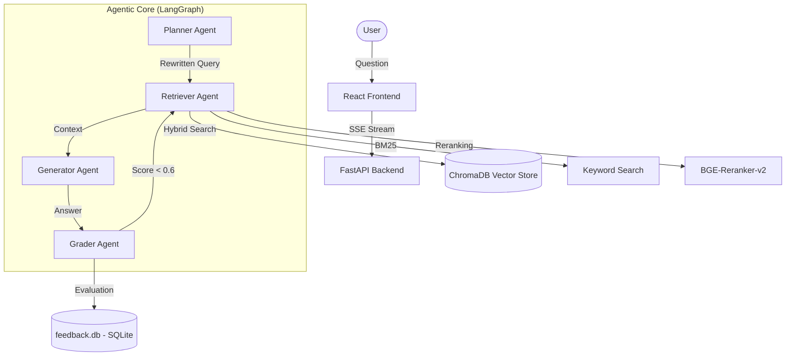

# Distributed Multi-Agent AI Knowledge System 🚀

A production-grade, self-improving RAG system built with **LangGraph**, **FastAPI**, and **React**.

[]()
[]()
[]()
[]()
[]()

---

## 📖 Overview

This is not a "hello world" RAG project. It is a **distributed multi-agent system** that uses autonomous agents to retrieve, generate, and evaluate answers. The system features a **Reflexion self-correction loop**, where the AI critiques its own work and retries retrieval if quality scores fall below production thresholds.

### 🎥 High-Level Architecture



---

## 🔥 Key Features

- **⚡ Multi-Agent Orchestration**: Four specialized agents (Planner, Retriever, Generator, Grader) managed by a LangGraph StateGraph.
- **🔄 Reflexion Loop**: The system identifies and self-corrects low-confidence or ungrounded answers automatically.
- **🔍 Advanced Retrieval**:
  - **Hybrid Search**: Combining Vector similarity with BM25 keyword matching.
  - **Reranking**: Using Cross-Encoders to ensure the most relevant context reaches the LLM.
- **📊 Observability & Metrics**:
  - **Live Agent Trace**: Watch every agent's thought process (Planner, Retriever, Generator, Grader) in real-time.
  - **Strategy Dashboard**: Professional data visualization (Recharts) showing performance trends.
- **🤖 Phase 5: Self-Improving Loop**: Automated pattern recognition that identifies documentation gaps based on real scores.
- **📈 Formal Evaluation**: A command-line engine to batch-test system accuracy (Achieving **0.97+ scores**).
- **🐳 Phase 6: Production Dockerization**: Multi-stage Nginx build serving the app on standard **Port 80**.

---

## 🛠️ Tech Stack

- **Backend**: Python 3.11, FastAPI, LangGraph, Pydantic v2.
- **AI Services**: Groq (Llama-3-70b), SentenceTransformers, ChromaDB.
- **Frontend**: React (Vite), TypeScript, TailwindCSS, Framer Motion.
- **Infrastructure**: Docker, Docker Compose, SQLite (Metrics).

---

## 🚦 Getting Started

### 📦 Prerequisites
- Docker & Docker Compose
- Groq API Key

### 🚀 Running the System

1.  **Clone the repository**:
    ```bash
    git clone https://github.com/Lalitha0421/Distributed-AI-master.git
    cd Distributed-AI-master
    ```

2.  **Set Environment Variables**:
    Create `.env` inside `backend/`:
    ```env
    GROQ_API_KEY=your_api_key_here
    DATABASE_URL=sqlite:///./feedback.db
    ```

3.  **Start the System**:
    ```bash
    docker-compose up --build
    ```

4.  **Access the Dashboard**:
    - **Frontend**: `http://localhost:80`
    - **API Docs**: `http://localhost:8000/docs`

---

## 📈 Monitoring & Feedback

The system continuously evaluates itself:
- **Faithfulness**: Is the answer grounded in the uploaded context?
- **Relevance**: Does the answer directly address the user query?
- **Self-Improvement**: Navigate to the sidebar to see automated "Insights" about which topics the model needs more data on.

---

## 🤝 Roadmap

- [x] Phase 1 - Production Code Quality & Schemas
- [x] Phase 2 - LangGraph Multi-Agent Orchestration
- [x] Phase 3 - Evaluation & Metrics Store
- [x] Phase 4 - Real-time Agent Trace UI
- [x] Phase 5 - Self-Improving Feedback Loop
- [x] Phase 6 - Docker Microservices & Deployment

---

*Built for the **Advanced AI Engineer Portfolio**. Optimized for scalability and observability.*
