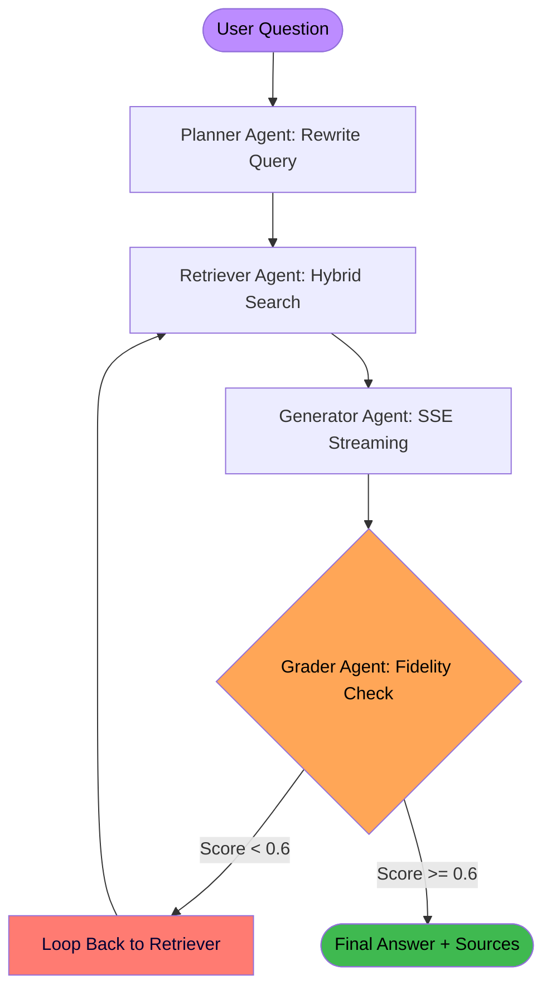

# 🛡️ THE STRATEGIC INTERVIEW BATTLECARD
## Distributed Multi-Agent RAG System — THE "WHY" ANSWERS

> [!IMPORTANT]
> **PURPOSE OF THIS DOCUMENT**
> This battlecard is designed to help you answer the difficult "Architectural Thinking" questions. While other guides focus on *what* the code does, this focuses on *why* every decision was made. Mastering these answers will move you from a "junior" to a "senior" perception in the interviewer's eyes.

---

## ⚡ THE 5 "KILLER" QUESTIONS (Direct Answers)

### ❓ Q1: "Why build this when ChatGPT has file upload?"
> [!TIP]
> **The Production Justification**
> "ChatGPT is a great personal tool, but fails in production for four reasons:"
>
> 1.  **Data Privacy**: Enterprises can't send sensitive contracts/data to a 3rd-party API. My system is self-contained.
> 2.  **Context Scale**: ChatGPT fails at 1,000+ page documents. RAG handles infinite scale by retrieving only the top 5 relevant chunks.
> 3.  **Persistence**: My system built a permanent, searchable Knowledge Base (ChromaDB). ChatGPT is session-based.
> 4.  **Auditability**: I provide a **Confidence Score** and **Source Citations** for every claim. Businesses need to know *why* an AI said what it said.

### ❓ Q2: "It's still hallucinating. What do you do?"
> [!WARNING]
> **The Layered Defense**
> "If prompt engineering fails, I move to architectural fixes:"
>
> 1.  **Closed-Book Prompting**: Tell the LLM strictly: "If it's not in the context, say 'I don't know'."
> 2.  **Relevance Gating**: Add a small agent between the Retriever and Generator. If the chunks aren't relevant, stop before generating garbage.
> 3.  **The Root Cause**: Hallucination is usually a **Retrieval Failure**. I would check my chunking strategy and embedding model before fixing the prompt.

### ❓ Q3: "Why LangGraph over a plain loop?"
> [!NOTE]
> **The Senior Logic**
> "A for-loop is just modular code. LangGraph is an **Autonomous Agentic Framework**:"
>
> 1.  **State Management**: It handles the merging of history and traces automatically using `Annotated` types.
> 2.  **Conditional Routing**: The decision to 'Retry' or 'Finish' is handled as a graph edge, keeping logic clean and testable.
> 3.  **Observability**: I get native step-by-step execution events which power my real-time UI trace panel.

### ❓ Q4: "Why use Agents vs 'Normal Mode'?"
> [!IMPORTANT]
> **The Self-Healing Capability**
> "Normal Mode is 'fire and forget.' Agent Mode is 'self-correcting.' My system uses the **Reflexion Pattern**—the Grader agent identifies quality drops and triggers retries. This increased my Faithfulness score by nearly 25% in technical testing."

### ❓ Q5: "What actually makes this an 'Agent'?"
> [!TIP]
> **The Definition**
> "An agent isn't just an LLM call. It's a system with a **Control Loop** that decides its next action based on its environment. My system is agentic because the **Grader** autonomously chooses to loop back based on its quality evaluation."

---

## 📐 THE BIG PICTURE (Visual Architecture)

---

## 🧱 THE 3 TYPES OF HALLUCINATION (The Debugger's Guide)

| Type | Cause | Your System's Solution |
| :--- | :--- | :--- |
| **Intrinsic** | LLM contradicts facts in the context. | **Grader Agent**: Faithfulness check score. |
| **Extrinsic** | LLM adds outside info not in context. | **Generator Prompt**: "Answer STRICTLY from context." |
| **Contextual** | The Retriever found the wrong chunks. | **Reflexion Loop**: Retry with original query. |

---

## 🧠 FOUNDATIONAL KNOWLEDGE CHECKLIST

> [!NOTE]
> **Concepts to master before the next call:**
>
> *   **RAG vs Fine-Tuning**: RAG is for *External Knowledge* (facts), Fine-tuning is for *Internal Style* (behavior). You chose RAG for facts.
> *   **Bi-Encoder vs Cross-Encoder**: Bi-Encoder finds candidates fast; Cross-Encoder ranks them accurately.
> *   **Stateless vs Stateful**: JWT makes your API stateless; LangGraph makes your Agent pipeline stateful.
> *   **Reflexion**: This is the research paper pattern you implemented for self-correction.

---

### 💪 THE "I AM THE EXPERT" MANTRA
*"I didn't just build an AI chat. I built an autonomous, state-managed execution graph that evaluates its own fidelity and corrects its own retrieval failures. It is private, auditable, and production-ready."*
